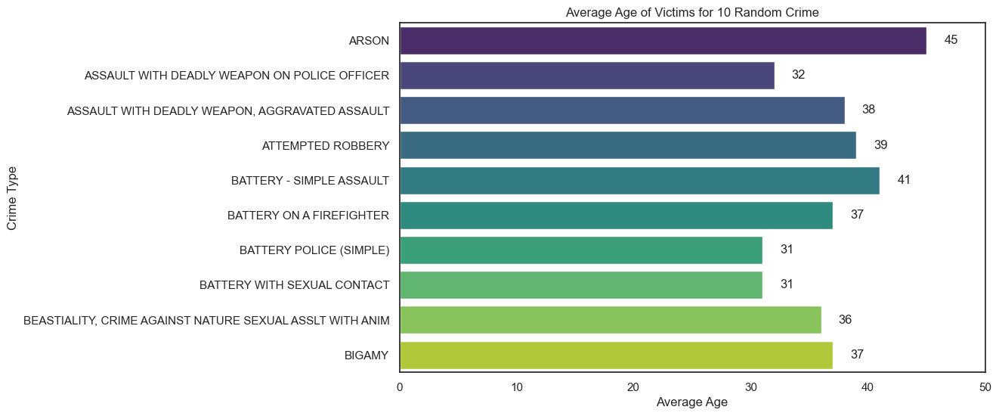

# LA Crime Data Analysis

## Introduction
Crime is a societal issue that impacts communities and cities around the world. Analyzing crime data helps to understand the nature, scale, and patterns of
criminal activities, enabling better decision-making in law enforcement and policy creation. This project focuses on exploratory analysis of crime 
 in Los Angeles, the second-most populous city in the United States, from 2020 to first quarter of 2023.

The objective of this analysis is to reveal patterns and trends in crime, understand the demographics of victims, determine peak times and locations for various crimes,
and gain other useful insights that can assist in developing effective crime prevention strategies.

Data for this project comes from [LA Crime Data](https://www.kaggle.com/datasets/chaitanyakck/crime-data-from-2020-to-present) available on Kaggle. The dataset contains
details about each reported crime event, including the date, type of crime, location, and demographics of the victim.

The primary tool used for this analysis tools were R, SQL and Python. R was used for cleaning the data using a library called `tidyverse`, which assists with data import, 
tidying and manipulation. SQL's powerful querying capabilities allow for complex analysis to be performed directly on the database. For further visualizations,
Python libraries such as pandas, matplotlib, and seaborn were used in addition to the dataframes generated by SQL queries.

The report includes detailed explanations of Data Cleaning Process, SQL queries used for the analysis, visualizations generated from the analysis, and discussions on the 
potential implications of the results.

## Data Cleaning and Preprocessing
Before delving into the analysis, an initial step of data cleaning and preprocessing was carried out to ensure the data quality and integrity. The tool of choice for this
phase was R, a language specifically designed for statistical analysis and data manipulation, along with its robust package 'tidyverse' which includes a collection of 
efficient tools for data cleaning.

The data set consist of the following columns related to the crime reported.
Sure, based on your provided column names and common conventions in crime datasets, here's a brief explanation of each:* DR_NO: This is likely a unique identifier for each crime report.

| Column Name | Description |
| ----------- | ----------- |
| Date_Rptd | The date when the crime was reported. |
| DATE_OCC | The date when the crime occurred. |
| TIME_OCC | The time when the crime occurred. |
| AREA | A numeric identifier for the area or district where the crime occurred. |
| AREA_NAME | The name of the area or district where the crime occurred. |
| Rpt_Dist_No | The reporting district number, which could refer to the specific police department or precinct that filed the report. |
| Part_1_2 | Indicates whether the crime is a Part I or Part II offense in the FBI's Uniform Crime Reporting (UCR) system. Part I offenses are major crimes like murder, rape, and robbery, while Part II offenses cover all other crimes. |
| Crm_Cd | A numeric identifier for the type of crime. |
| Crm_Cd_Desc | A description of the type of crime. |
| Mocodes | Modus Operandi codes, which provide details about the method or tactics the criminal used. |
| Vict_Age | The age of the victim. |
| Vict_Sex | The sex of the victim. |
| Vict_Descent | The descent or ethnicity of the victim. |
| Premis_Cd | A code representing the type of location where the crime occurred. |
| Premis_Desc | A description of the type of location where the crime occurred. |
| Weapon_Used_Cd | A code representing the type of weapon used in the crime. |
| Weapon_Desc | A description of the type of weapon used in the crime. |
| Status | A code representing the status of the investigation or case. |
| Status_Desc | A description of the status of the investigation or case. |
| Crm_Cd_1 | Additional crime code associated with the incident. |
| Crm_Cd_2 | Additional crime code associated with the incident. |
| Crm_Cd_3 | Additional crime code associated with the incident. |
| Crm_Cd_4 | Additional crime code associated with the incident. |
| LOCATION | The specific location where the crime occurred, potentially an address or specific landmark. |
| Cross_Street | The nearest cross-street or intersection to where the crime occurred. This is often used when an exact address isn't available or relevant. |
| LAT | The latitude coordinate of the crime location. |
| LON | The longitude coordinate of the crime location. |

Initially, the dataset was inspected for null values `colSums(is.na(crime_data))` to find total numm values in each column. It was found that several columns
contained a significant percentage of missing data. It is crucual to detal with missing values since they can skew the analysis and lead to incorrect conclusions.

Specifically, columns such as 'Mocodes'. 'Vict_Sex', 'Vict_Descent', 'Weapon_Used_Cd' and 'Weapon_Desc' has missing data. Rather than discarding these rows entirely,
which might have resulted in a significant loss of information, the decision was made to impute these missing values. For example categorical variables, missing value
were replaced with 'Unknown', allowing us to retain these records for analysis without creating misleading results.

For instance, 'Weapon_Used_Cd' and 'Weapon_Desc', despite having a high percentage of missing data, was considered important for the analysis.
The assumption was made that a missing value in 'Weapon_Used_Cd' and 'Weapon_Desc' indicated that the weapon was unknown, and therefore, these
were filled with 0 and 'Unknown' respectively.

On the other hand, the null values were set to 0 in case of 'Vict Age'. The negative values, which could be data entry errors were filtered during analysis
as they weren't in large quantity.

Other than that, 'Premis_Cd', 'Status Desc' and 'Crm Cd 1' had very few null values, which wouldn't make significant difference to this large dataset. Thus, rows with null values
in these columns were removed.

This preprocessing step produced a clean, structured dataset, setting a solid foundation for the ensuing exploratory data analysis and visualizations step.

## Exploratory Data Analysis
The Exploratory Data Analysis(EDA) phase was primarily executed using SQL, with the intent to gain insights into the patterns and relationships within our dataset.
SQL, with its powerful querying and data manipulation capabilities, was ideal choice for this exercise. The visualizations using the data generated from sql queries
was done using Python with the help of `psycopg2` to connect to database, `pandas` to generate dataframe, and `matplotlib` and `seaborn` for generating visualizations.
Our analysis was guided by a set of key questions designed to explore the structure, characteristics, and patterns within the data

### 1. What is the most common type of crime (based on 'Crm Cd Desc') in each area (based on 'AREA NAME')?
A combination of grouping and ordering SQL commands helped to identify the most common crime in each area. Using window functions like
`ROW_NUMBER()` enabled us to return the crime with the highest occurrence in each area. This provided insights into the local crime dymanics
and potential area-specific crime issues. The SQL query is as below:
```
WITH crime_counts AS (
	select area_name, crm_cd_desc, 
	count(*) as count_per_area_per_crime,
	ROW_NUMBER() OVER (PARTITION BY area_name ORDER BY COUNT(*) DESC) as rn
	from la_crime 
	group by area_name,crm_cd_desc 
)

SELECT area_name, crm_cd_desc as most_common_crime, count_per_area_per_crime 
from crime_counts
where rn=1
```


The barplots suggests that "Vehicle-Stolen" is the most common crime across most of the areas. Some exceptions were "Central" with 'Burglary from vehicle', "Hollywood" with 'Battery - Simple Assualt',
and "Burglary" in  "Topanga","West LA", "Wilshire"

### 2.  How does the time of occurrence ('TIME OCC') relate to the type of crime ('Crm Cd Desc')? Are certain crimes more likely at certain times of day?
This SQL query retrieves crime data from the "la_crime" table and summarizes it by crime description and the corresponding time period of occurrence. It calculates the time period based on the hour of occurrence and categorizes it as "Night," "Morning," "Afternoon," or "Evening." The query then groups the data by crime description and time period and provides the count of crimes for each combination. The results are ordered by crime description in ascending order and crime count in descending order.
The SQL query for this operation is as below:
```
SELECT 
crm_cd_desc,
CASE
	WHEN EXTRACT(HOUR FROM time_occ) BETWEEN 0 AND 5 THEN 'Night'
	WHEN EXTRACT(HOUR FROM time_occ) BETWEEN 6 AND 11 THEN 'Morning'
	WHEN EXTRACT(HOUR FROM time_occ) BETWEEN 12 AND 17 THEN 'Afternoon'
	ELSE 'Evening'
END as time_period,
count(*) as crime_count
from la_crime
group by crm_cd_desc, time_period
order by crm_cd_desc, crime_count desc;
```
The visualization was generated using only top 10 crimes with most occurence, as there are large amount of crimes and the plot gets cluttered for all the data. A heat map after creating pivot table from the data generated by the sql query.

<div align="center">
 
</div>

The heatmap summarizes that most of the crimes usually occurs at the time period of afternoon or evening, while the crimes less likely occur during the morning and night in general.

## 3. What is the average age ('Vict Age') of victims for each type of crime ('Crm Cd Desc')?
To understand the demographic of most affected by the type of crime, the average age of victims was calculated per crime type. This analysis was made more accurate by excluding rows where victim age was zero,
which had been previously imputed during the data cleaning process. The sql query used grouping according crime to calculate the average victim age.
The sql query is as below:
```
SELECT 
crm_cd_desc as Crime , 
ROUND(AVG(vict_age)) AS "Average Age"
from la_crime
WHERE vict_age != 0
group by crm_cd_desc
```
The barplot was created using only the top 10 most occurring crime generated by the sql query.


A histogram was generated to view the distribution of victim age as below:

<div align="center">
 
</div>
The barplot provides insight into the age distribution of crime victims, revealing that a significant portion of them falls within the range above 30 years. This suggests that individuals in their 30s and beyond are more susceptible to becoming victims of crimes.

The histogram presents a visual representation of the distribution of average ages among crime victims. It exhibits a normal distribution pattern, indicating that the majority of victims have an average age around 40. This suggests that 40-year-olds are particularly vulnerable to criminal activities, as they comprise the peak of the distribution. The histogram provides a clear depiction of the central tendency and dispersion of average ages among crime victims.

## 4. Are men, women, or non-binary individuals ('Vict Sex') more likely to be victims of certain types of crimes ('Crm Cd Desc')?
Understanding the dynamics of crime victimization is essential for identifying patterns and addressing vulnerabilities within different populations. One aspect to consider is the relationship between gender identity ('Vict Sex') and the likelihood of being a victim of specific types of crimes ('Crm Cd Desc'). By examining available data, we can explore whether men, women, or non-binary individuals are more susceptible to certain categories of crimes. This analysis can contribute to developing targeted prevention strategies and support systems tailored to the unique needs of various gender identities.
For this purpose, sql query was written which was grouped by "crm_cd_desc" and "vict_sex" to find out which genders are affected the most.
The sql query for this task is:
```
SELECT
 crm_cd_desc,
 vict_sex,
 count(*) as victim_count
from la_crime
group by crm_cd_desc, vict_sex
order by crm_cd_desc asc, victim_count desc
```
<div align="center">
 
</div>

This plot was plotted for only the top 10 most occurring crime to avoid cluttering. It reflected that men are more 
victimized in crimes such as "Assault with deadly weapon/aggravated assault","battery - simple assault","burglary","burglary from vehicle" and such.
It also gave insights that female ares more likely to be victims in domestic violence (intimate partner - simple assault), theft of identity and such.
Non-Binary individuals (X) had the lowest proportion in victims, which may be due to the fact they are few in numbers.

## 5. How does crime rate change over the years? Is there an overall increasing or decreasing trend?
This analysis involved grouping by year and counting the number of crimes, which was achieved by using the EXTRACT() function to extract the year from the 'Date_Occ' column. This helped us understand the trend of crime rates over the years, indicating whether there has been an increase or decrease in overall crime incidents.
This information is valuable for shaping crime prevention strategies and understanding societal factors influencing criminal activities. The sql
query used for this operation is as below:
```
SELECT
 EXTRACT(YEAR FROM date_occ) as Year,
 COUNT(*) as Crime_Count,
 COUNT(*) / MAX(EXTRACT(DOY FROM date_occ)) as Average_Crimes_Per_Day
FROM la_crime
GROUP BY Year
ORDER BY Year ASC
```
<div align="center">
 
</div>

The graph shows a rapid increase in crime per day over the years from 2020 to 2022. The graph showed less crimes per day in 2023
which may be due to the fact that all the crimes in 2023 has not been reported yet or are yet to occur. 


