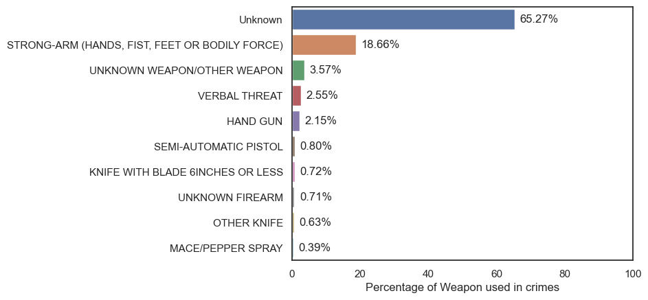
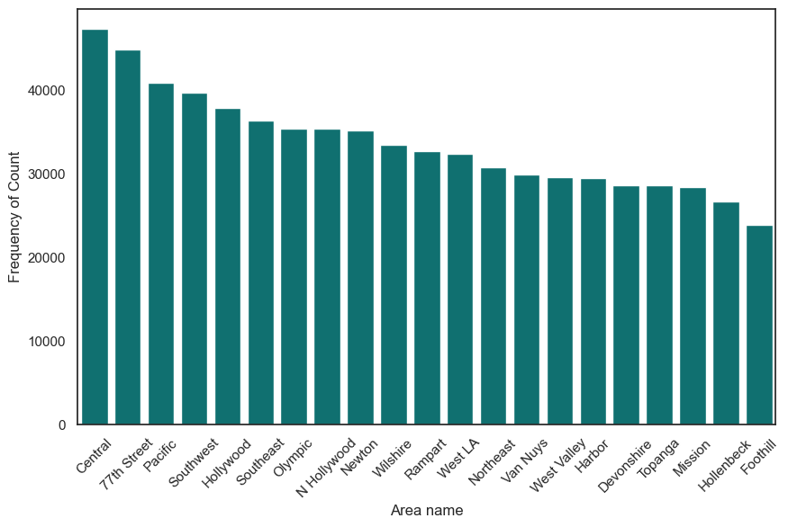
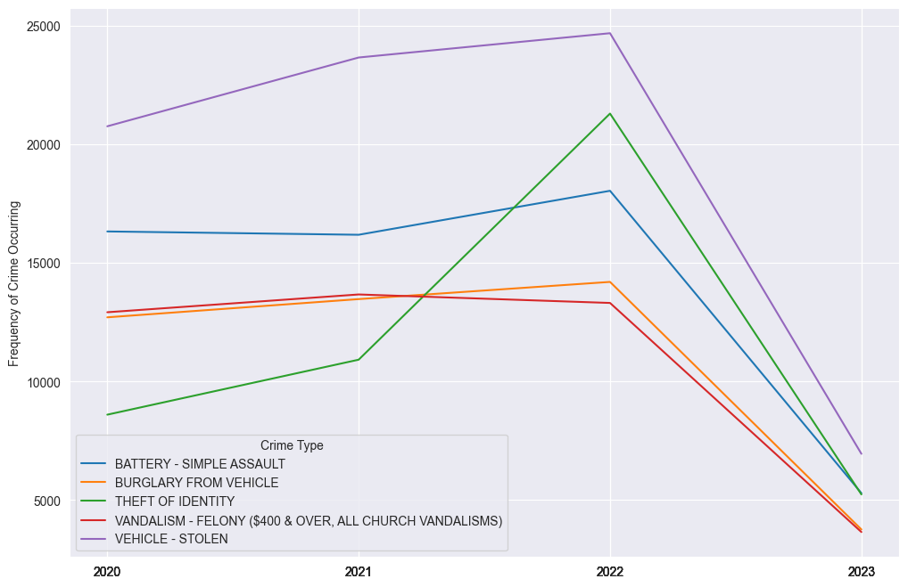
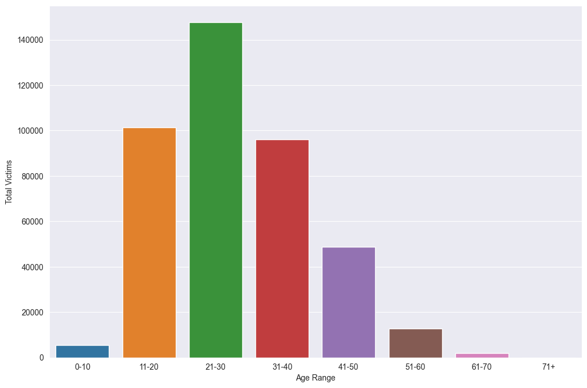

# LA Crime Data Analysis

## Introduction
Crime is a societal issue that impacts communities and cities around the world. Analyzing crime data helps to understand the nature, scale, and patterns of
criminal activities, enabling better decision-making in law enforcement and policy creation. This project focuses on exploratory analysis of crime 
 in Los Angeles, the second-most populous city in the United States, from 2020 to first quarter of 2023.

The objective of this analysis is to reveal patterns and trends in crime, understand the demographics of victims, determine peak times and locations for various crimes,
and gain other useful insights that can assist in developing effective crime prevention strategies.

Data for this project comes from [LA Crime Data](https://www.kaggle.com/datasets/chaitanyakck/crime-data-from-2020-to-present) available on Kaggle. The dataset contains
details about each reported crime event, including the date, type of crime, location, and demographics of the victim.

The primary tool used for this analysis tools were R, SQL and Python. R was used for cleaning the data using a library called `tidyverse`, which assists with data import, 
tidying and manipulation. SQL's powerful querying capabilities allow for complex analysis to be performed directly on the database. For further visualizations,
Python libraries such as pandas, matplotlib, and seaborn were used in addition to the dataframes generated by SQL queries.

The report includes detailed explanations of Data Cleaning Process, SQL queries used for the analysis, visualizations generated from the analysis, and discussions on the 
potential implications of the results.

## Data Cleaning and Preprocessing
Before delving into the analysis, an initial step of data cleaning and preprocessing was carried out to ensure the data quality and integrity. The tool of choice for this
phase was R, a language specifically designed for statistical analysis and data manipulation, along with its robust package 'tidyverse' which includes a collection of 
efficient tools for data cleaning.

The data set consist of the following columns related to the crime reported.
Sure, based on your provided column names and common conventions in crime datasets, here's a brief explanation of each:* DR_NO: This is likely a unique identifier for each crime report.

| Column Name | Description |
| ----------- | ----------- |
| Date_Rptd | The date when the crime was reported. |
| DATE_OCC | The date when the crime occurred. |
| TIME_OCC | The time when the crime occurred. |
| AREA | A numeric identifier for the area or district where the crime occurred. |
| AREA_NAME | The name of the area or district where the crime occurred. |
| Rpt_Dist_No | The reporting district number, which could refer to the specific police department or precinct that filed the report. |
| Part_1_2 | Indicates whether the crime is a Part I or Part II offense in the FBI's Uniform Crime Reporting (UCR) system. Part I offenses are major crimes like murder, rape, and robbery, while Part II offenses cover all other crimes. |
| Crm_Cd | A numeric identifier for the type of crime. |
| Crm_Cd_Desc | A description of the type of crime. |
| Mocodes | Modus Operandi codes, which provide details about the method or tactics the criminal used. |
| Vict_Age | The age of the victim. |
| Vict_Sex | The sex of the victim. |
| Vict_Descent | The descent or ethnicity of the victim. |
| Premis_Cd | A code representing the type of location where the crime occurred. |
| Premis_Desc | A description of the type of location where the crime occurred. |
| Weapon_Used_Cd | A code representing the type of weapon used in the crime. |
| Weapon_Desc | A description of the type of weapon used in the crime. |
| Status | A code representing the status of the investigation or case. |
| Status_Desc | A description of the status of the investigation or case. |
| Crm_Cd_1 | Additional crime code associated with the incident. |
| Crm_Cd_2 | Additional crime code associated with the incident. |
| Crm_Cd_3 | Additional crime code associated with the incident. |
| Crm_Cd_4 | Additional crime code associated with the incident. |
| LOCATION | The specific location where the crime occurred, potentially an address or specific landmark. |
| Cross_Street | The nearest cross-street or intersection to where the crime occurred. This is often used when an exact address isn't available or relevant. |
| LAT | The latitude coordinate of the crime location. |
| LON | The longitude coordinate of the crime location. |

Initially, the dataset was inspected for null values `colSums(is.na(crime_data))` to find total numm values in each column. It was found that several columns
contained a significant percentage of missing data. It is crucual to detal with missing values since they can skew the analysis and lead to incorrect conclusions.

Specifically, columns such as 'Mocodes'. 'Vict_Sex', 'Vict_Descent', 'Weapon_Used_Cd' and 'Weapon_Desc' has missing data. Rather than discarding these rows entirely,
which might have resulted in a significant loss of information, the decision was made to impute these missing values. For example categorical variables, missing value
were replaced with 'Unknown', allowing us to retain these records for analysis without creating misleading results.

For instance, 'Weapon_Used_Cd' and 'Weapon_Desc', despite having a high percentage of missing data, was considered important for the analysis.
The assumption was made that a missing value in 'Weapon_Used_Cd' and 'Weapon_Desc' indicated that the weapon was unknown, and therefore, these
were filled with 0 and 'Unknown' respectively.

On the other hand, the null values were set to 0 in case of 'Vict Age'. The negative values, which could be data entry errors were filtered during analysis
as they weren't in large quantity.

Other than that, 'Premis_Cd', 'Status Desc' and 'Crm Cd 1' had very few null values, which wouldn't make significant difference to this large dataset. Thus, rows with null values
in these columns were removed.

This preprocessing step produced a clean, structured dataset, setting a solid foundation for the ensuing exploratory data analysis and visualizations step.

## Exploratory Data Analysis
The Exploratory Data Analysis(EDA) phase was primarily executed using SQL, with the intent to gain insights into the patterns and relationships within our dataset.
SQL, with its powerful querying and data manipulation capabilities, was ideal choice for this exercise. The visualizations using the data generated from sql queries
was done using Python with the help of `psycopg2` to connect to database, `pandas` to generate dataframe, and `matplotlib` and `seaborn` for generating visualizations.
Our analysis was guided by a set of key questions designed to explore the structure, characteristics, and patterns within the data

### 1. What is the most common type of crime (based on 'Crm Cd Desc') in each area (based on 'AREA NAME')?
A combination of grouping and ordering SQL commands helped to identify the most common crime in each area. Using window functions like
`ROW_NUMBER()` enabled us to return the crime with the highest occurrence in each area. This provided insights into the local crime dymanics
and potential area-specific crime issues. The SQL query is as below:
```
WITH crime_counts AS (
	select area_name, crm_cd_desc, 
	count(*) as count_per_area_per_crime,
	ROW_NUMBER() OVER (PARTITION BY area_name ORDER BY COUNT(*) DESC) as rn
	from la_crime 
	group by area_name,crm_cd_desc 
)

SELECT area_name, crm_cd_desc as most_common_crime, count_per_area_per_crime 
from crime_counts
where rn=1
```


The barplots suggests that "Vehicle-Stolen" is the most common crime across most of the areas. Some exceptions were "Central" with 'Burglary from vehicle', "Hollywood" with 'Battery - Simple Assualt',
and "Burglary" in  "Topanga","West LA", "Wilshire"

### 2.  How does the time of occurrence ('TIME OCC') relate to the type of crime ('Crm Cd Desc')? Are certain crimes more likely at certain times of day?
This SQL query retrieves crime data from the "la_crime" table and summarizes it by crime description and the corresponding time period of occurrence. It calculates the time period based on the hour of occurrence and categorizes it as "Night," "Morning," "Afternoon," or "Evening." The query then groups the data by crime description and time period and provides the count of crimes for each combination. The results are ordered by crime description in ascending order and crime count in descending order.
The SQL query for this operation is as below:
```
SELECT 
crm_cd_desc,
CASE
	WHEN EXTRACT(HOUR FROM time_occ) BETWEEN 0 AND 5 THEN 'Night'
	WHEN EXTRACT(HOUR FROM time_occ) BETWEEN 6 AND 11 THEN 'Morning'
	WHEN EXTRACT(HOUR FROM time_occ) BETWEEN 12 AND 17 THEN 'Afternoon'
	ELSE 'Evening'
END as time_period,
count(*) as crime_count
from la_crime
group by crm_cd_desc, time_period
order by crm_cd_desc, crime_count desc;
```
The visualization was generated using only top 10 crimes with most occurence, as there are large amount of crimes and the plot gets cluttered for all the data. A heat map after creating pivot table from the data generated by the sql query.

<div align="center">
 
</div>

The heatmap summarizes that most of the crimes usually occurs at the time period of afternoon or evening, while the crimes less likely occur during the morning and night in general.

## 3. What is the average age ('Vict Age') of victims for each type of crime ('Crm Cd Desc')?
To understand the demographic of most affected by the type of crime, the average age of victims was calculated per crime type. This analysis was made more accurate by excluding rows where victim age was zero,
which had been previously imputed during the data cleaning process. The sql query used grouping according crime to calculate the average victim age.
The sql query is as below:
```
SELECT 
crm_cd_desc as Crime , 
ROUND(AVG(vict_age)) AS "Average Age"
from la_crime
WHERE vict_age != 0
group by crm_cd_desc
```
The barplot was created using only the top 10 most occurring crime generated by the sql query.


A histogram was generated to view the distribution of victim age as below:

<div align="center">
 
</div>
The barplot provides insight into the age distribution of crime victims, revealing that a significant portion of them falls within the range above 30 years. This suggests that individuals in their 30s and beyond are more susceptible to becoming victims of crimes.

The histogram presents a visual representation of the distribution of average ages among crime victims. It exhibits a normal distribution pattern, indicating that the majority of victims have an average age around 40. This suggests that 40-year-olds are particularly vulnerable to criminal activities, as they comprise the peak of the distribution. The histogram provides a clear depiction of the central tendency and dispersion of average ages among crime victims.

## 4. Are men, women, or non-binary individuals ('Vict Sex') more likely to be victims of certain types of crimes ('Crm Cd Desc')?
Understanding the dynamics of crime victimization is essential for identifying patterns and addressing vulnerabilities within different populations. One aspect to consider is the relationship between gender identity ('Vict Sex') and the likelihood of being a victim of specific types of crimes ('Crm Cd Desc'). By examining available data, we can explore whether men, women, or non-binary individuals are more susceptible to certain categories of crimes. This analysis can contribute to developing targeted prevention strategies and support systems tailored to the unique needs of various gender identities.
For this purpose, sql query was written which was grouped by "crm_cd_desc" and "vict_sex" to find out which genders are affected the most.
The sql query for this task is:
```
SELECT
 crm_cd_desc,
 vict_sex,
 count(*) as victim_count
from la_crime
group by crm_cd_desc, vict_sex
order by crm_cd_desc asc, victim_count desc
```
<div align="center">
 
</div>

This plot was plotted for only the top 10 most occurring crime to avoid cluttering. It reflected that men are more 
victimized in crimes such as "Assault with deadly weapon/aggravated assault","battery - simple assault","burglary","burglary from vehicle" and such.
It also gave insights that female ares more likely to be victims in domestic violence (intimate partner - simple assault), theft of identity and such.
Non-Binary individuals (X) had the lowest proportion in victims, which may be due to the fact they are few in numbers.

## 5. How does crime rate change over the years? Is there an overall increasing or decreasing trend?
This analysis involved grouping by year and counting the number of crimes, which was achieved by using the EXTRACT() function to extract the year from the 'Date_Occ' column. This helped us understand the trend of crime rates over the years, indicating whether there has been an increase or decrease in overall crime incidents.
This information is valuable for shaping crime prevention strategies and understanding societal factors influencing criminal activities. The sql
query used for this operation is as below:
```
SELECT
 EXTRACT(YEAR FROM date_occ) as Year,
 COUNT(*) as Crime_Count,
 COUNT(*) / MAX(EXTRACT(DOY FROM date_occ)) as Average_Crimes_Per_Day
FROM la_crime
GROUP BY Year
ORDER BY Year ASC
```
<div align="center">
 
</div>

The graph shows a rapid increase in crime per day over the years from 2020 to 2022. The graph showed less crimes per day in 2023
which may be due to the fact that all the crimes in 2023 has not been reported yet or are yet to occur. 

Overall, there is an increasing trend in crime occurrence over the recent years.

## 6. How does the rate of crimes differ between different descents ('Vict Descent')?
Grouping by 'Vict Descent', and then calculating the total number and rate of crimes for each category gave us insight into which demographics were more likely to be victims of crimes.
The sql query for this task is as below:
```
vict_descent,
COUNT(*) as Crime_Count
FROM la_crime
group by vict_descent
order by Crime_Count desc
```
<div align="center">
 
</div>
The "Vict Descent" column in the LA Crime dataset represents the descent of the victim. Here are the codes that Los Angeles Police Department uses:

| Code | Race/Ethnicity                  |
|:----:|:-------------------------------:|
| A    | Other Asian                     |
| B    | Black                           |
| C    | Chinese                         |
| D    | Cambodian                       |
| F    | Filipino                        |
| G    | Guamanian                       |
| H    | Hispanic/Latin/Mexican          |
| I    | American Indian/Alaskan Native  |
| J    | Japanese                        |
| K    | Korean                          |
| L    | Laotian                         |
| O    | Other                           |
| P    | Pacific Islander                |
| S    | Samoan                          |
| U    | Hawaiian                        |
| V    | Vietnamese                      |
| W    | White                           |
| X    | Unknown                         |
| Z    | Asian Indian                    |

The data reveals that Hispanic/Latin/Mexican individuals are the most victimized group, followed by White, Black, and others. It's important to note that there is a category for unknown descent (X) and cases where descent information isn't available (NA). 


## 7. What percentage of crimes involve the use of weapons ('Weapon Used Cd' or 'Weapon Desc')?
By using subquery and grouping on outer query we were able to get the count of weapon used and their use percentage from the data. It is crucial to know what weapons are mostly used in crimes to regulate their uses.
The sql query for this task is as below:
```
SELECT 
 weapon_desc,
 count(*) as weapon_used_count,
 (count(*) / (SELECT count(*) from la_crime)::float)*100 As Weapon_Used_percentage
from la_crime
group by weapon_desc
order by weapon_used_count desc
```
Since, there are information of about 80 weapons used, it makes the generated graph cluttered. Thus, we will plot using only the top 10 weapons.
<div align="center">
 
</div>

We know that about 65.27% of weapons data in the dataset were NA, they were replaced by "Unknown". Ignoring those, it can be noted that
strong-arm (hands, fits, feet or bodily force) were used in most cases, denoting unarmed crimes. Other than that 3.57% of total cases had unknown weapon,
while 2.55% were just verbal threat, meaning non-violent crimes. There was usage of 2.15% of hand gun, which might seems a lot, but can cause much more damage than other means.
Other weapons were used less than 1%.

## 8. What are the most common locations for crimes to occur (based on 'LOCATION')?
By grouping according to area_name, we can identify the areas of places that experience the highest criminal activities.This analysis allows us to uncover patterns and trends in crime distribution, aiding law enforcement agencies, policymakers, and communities in prioritizing resources and implementing targeted interventions to improve safety and security.
The sql query for this task is as below:
```
SELECT
 area_name,
 count(*) as crime_count
 from la_crime
group by area_name
order by crime_count desc
```

<div align="center">
 
</div>

This data generates insights that Central area of LA is the most criminally active place, followed closely by 77th Street, Pacific, Hollywood,etc.,
with Foothill recording the least crimes of all the areas. This signifies the need to increase securities in the highly criminal areas that have been identified with this data.

## 9. Are there certain crimes that are increasing or decreasing over time more than others?
Identifying certain crimes that are increasing or decreasing over time can be crucial to implement rules and regulations to control those said crimes.
This can be done using cte and lag() function to keep track of the changes occuring with respect to previous year to find which crime have most increase or decrease.
The sql query for this task is as below:
```
WITH crime_over_time AS (
  SELECT
    EXTRACT(YEAR FROM date_occ) AS year,
    crm_cd_desc,
    COUNT(*) AS crime_count,
    LAG(COUNT(*)) OVER (PARTITION BY crm_cd_desc ORDER BY EXTRACT(YEAR FROM date_occ)) AS previous_count
  FROM
    la_crime
  GROUP BY
    year, crm_cd_desc
)
SELECT
  year,
  crm_cd_desc,
  crime_count,
  previous_count,
  crime_count - previous_count AS count_change
FROM
  crime_over_time
```
We can generate a linechart to see the increase or decrease trend over time. But since there are large number of crime types, we limit our graph to display only the top 5 most occuring crime.
<div align="center">
 
</div>

From this graph, it can be seen that most crimes have increasing trends, with "Theft of Identity" showing sharp increase from 2021 to 2022. However,
other most occurring crimes like 'Battery - Simple Vehicle',"Burglary from vehicle","Vandalism", "Vehicle stolen" having slight change over the years. The 2023 data can be ignored as its incomplete since the year hasn't ended.

## 10 .  Are certain types of crime more prevalent in certain areas?
Identifying crimes that are more prevalent in certain areas can be done using SQL using cte, window function row_number(), joins and grouping. This information can help in understanding if there are certain crimes that are common in most regions.
The sql query for this tak is as below:
```
with total_crimes_by_area as (
Select
	area_name,
	count(*) as total_crime_count
	from la_crime
	group by area_name
),
crime_counts_by_area as (
	SELECT 
	area_name,
	crm_cd_desc,
	count(*) as crime_count,
	ROW_NUMBER() OVER (PARTITION BY area_name ORDER BY COUNT(*) desc) as rn
	from la_crime
	group by area_name, crm_cd_desc
)

select 
	cc.area_name, 
	cc.crm_cd_desc,
	cc.crime_count,
	cc.crime_count * 100.0 / tc.total_crime_count as crime_proportion
from crime_counts_by_area as cc
JOIN
	total_crimes_by_area as tc ON cc.area_name = tc.area_name
where rn <=5
ORDER BY 
    cc.area_name, 
    cc.crime_count DESC;
```

The graph reveals that "vehicle - stolen" is the most frequently occurring crime in a majority of areas. This suggests that incidents of vehicle theft are a prevalent concern across different locations. Additionally, other common crimes that are prominent include "Burglary," indicating unauthorized entry into properties with intent to commit theft or other offenses, "battery - simple assault," which involves non-aggravated physical altercations, and "vandalism," encompassing acts of willful property damage. These findings highlight the need for targeted efforts in addressing vehicle theft, burglary prevention, tackling assault incidents, and promoting measures to deter vandalism in order to enhance public safety and reduce crime rates.

## 11. Are certain crimes more likely to happen at certain times of the year?
It is rather important to find which crimes occur at certain time of year such as which month they are most likely to occur in. This helps in preparing cautionary methods for that crime in that specific time of the year.
This can be done in sql by grouping the data by "crm_cd_desc", extract() function to extract the month. Since, 2023 data is incomplete we exclude it. As there more large number of crime, we can concentrate on top 5 crimes, which is filtered in python using pandas.
The sql query for this task is:
```
SELECT
 crm_cd_desc,
 EXTRACT (MONTH from date_occ) as month_of_occurence,
 count(*) as crime_count
FROM la_crime
WHERE EXTRACT(YEAR from date_occ) < 2023
group by crm_cd_desc, month_of_occurence
order by crm_cd_desc, crime_count

```
<div align="center">
 
</div>

It can be seen that "Vehicle-stolen" is maximum among all the crime throughout the year, with its max occurrence from the start of 2nd quarter to the end of year.
Among other crimes, "Battery - Simple Assault" seems to be maximum around 7th month, "Vandalism" seems to be most from 5th month to 7th month. "Burglary from vehicle" seems to be max at the start of year and end of year.
In addition to this, "Theft of identity" seems to start at minimum at the start of year, reaching highest at the end of year at 12th month. The security policies can be made based on their peak occurrence throughout the year.

## 12. Which area has the most crimes?
Determining the area with the highest number of crimes provides valuable insights into the concentration of criminal activities and helps prioritize resource allocation and crime prevention efforts. It can be done using simple sql query
to group by area_name and order by crime_count in descending order, and limit output to 1. The sql query for this task is:
```
SELECT
	area_name,
	count(*) as crime_count
FROM la_crime
group by area_name
order by crime_count desc
limit 1
```

This query gave the following result:
### Area with most Crime: Central with 47439 crimes

## 13. Which area has the least crimes?
Identifying the area with the least number of crimes is essential for understanding areas of relatively lower crime rates and potentially offering insights into effective crime prevention strategies.
It can be done using simple sql query to group by area_name and order by crime_count in aescending order, and limit output to 1. The sql query for this task is:
```
SELECT
	area_name,
	count(*) as crime_count
FROM la_crime
group by area_name
order by crime_count asc
limit 1
```

This query gave the following result:
### Area with the least Crime: Foothill with 23946 crimes

## 14. What is the distribution of victim's age for unsolved crimes?
The distribution of victim's age for unsolved crimes can be created using CASE for the creation of age bucket, subquery to
include only unsolved crime, and finally grouping by age range. The sql query for this case is;
```
SELECT
	CASE
		WHEN age_bucket=1 THEN '0-10'
		WHEN age_bucket=2 THEN '11-20'
		WHEN age_bucket=3 THEN '21-30'
	    WHEN age_bucket = 4 THEN '31-40'
        WHEN age_bucket = 5 THEN '41-50'
        WHEN age_bucket = 6 THEN '51-60'
        WHEN age_bucket = 7 THEN '61-70'
        ELSE '71+'
	END as age_range,
	count(*) as total_victims
FROM
	(select
		width_bucket(vict_age ,0,100,7) as age_bucket
	from la_crime
	where
		status='IC' and vict_age >0) sub
group by age_range
```
<div align="center">
 
</div>
The analysis of the distribution of victim's age in unsolved crimes reveals an interesting pattern. The data indicates a normal distribution, suggesting that the ages of victims follow a typical bell-shaped curve. Notably, the age group of 21-30 appears to be particularly vulnerable, with a higher likelihood of being victims of crimes. This finding highlights the importance of targeted prevention strategies and support systems for individuals within this age range, aimed at reducing victimization rates and enhancing their safety and security

## 15. How does the crime rate compare between different sexes and descents?
Comparing the crime rates between different sexes and descents provides valuable insights into the variations and disparities in victimization across diverse demographic groups. By analyzing the available data, we can examine whether there are notable differences in crime rates based on sex (male, female, non-binary) and descent (such as Hispanic/Latin/Mexican, White, Black, and others). This analysis allows for a deeper understanding of how different populations are affected by crime and provides a foundation for developing targeted interventions and policies to address the specific needs and challenges faced by these groups. Let's explore the data to gain a 
better understanding of the comparative crime rates among various sexes and descents.

The sql query for comparing crime_rate by different sex is:
```
SELECT 
    vict_sex,
    count(*) as total_crimes,
    ROUND((count(*)::NUMERIC / (SELECT COUNT(*) FROM la_crime)::NUMERIC) * 100.0, 2) as crime_rate
FROM la_crime
GROUP BY vict_sex
ORDER BY crime_rate desc
```

<div align="center">
 
</div>

Males are the sex who end up becoming the most victims, followed by female with 41.50% and 36.99 % respectively. Binary gender had about 8.41% reports in which they were victimized.
H and Unknown are the groups where gender is unknown.

The sql query for comparing crime_rate by different descent is:
```
SELECT 
    vict_descent,
    count(*) as total_crimes,
    ROUND((count(*)::NUMERIC / (SELECT COUNT(*) FROM la_crime)::NUMERIC) * 100.0, 2) as crime_rate
FROM la_crime
GROUP BY vict_descent
ORDER BY crime_rate desc
```
<div align="center">
 
</div>

The data reveals that Hispanic/Latin/Mexican individuals are the most victimized group, followed by White, Black, and others. It's important to note that there is a category for unknown descent (X) and cases where descent information isn't available (NA).


These analyses, grounded in the exploration of our key questions, provided a comprehensive understanding of the dataset, allowing us to identify key patterns, trends, and relationships within the crime data.